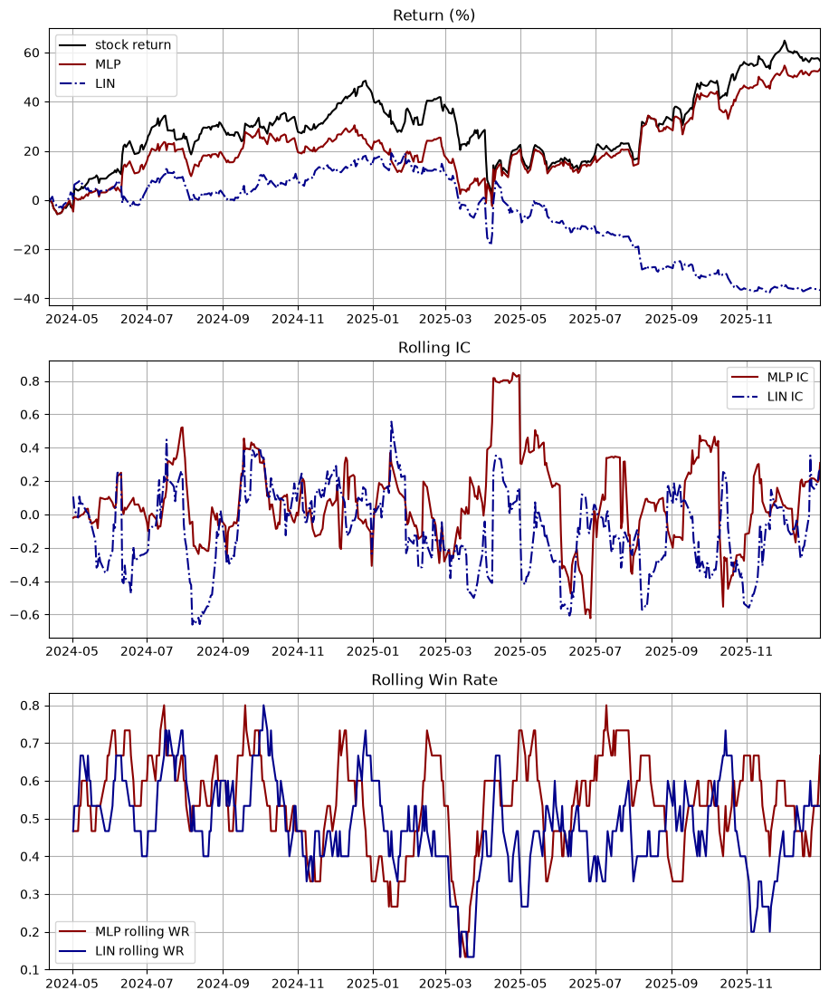
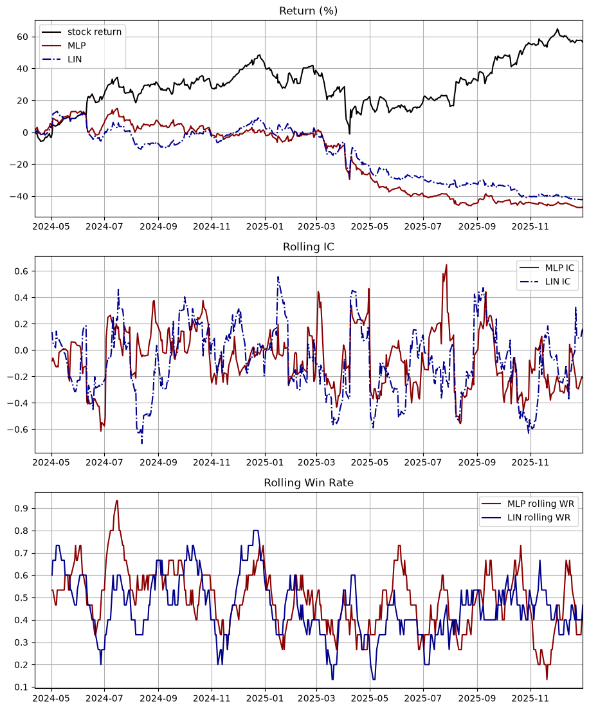
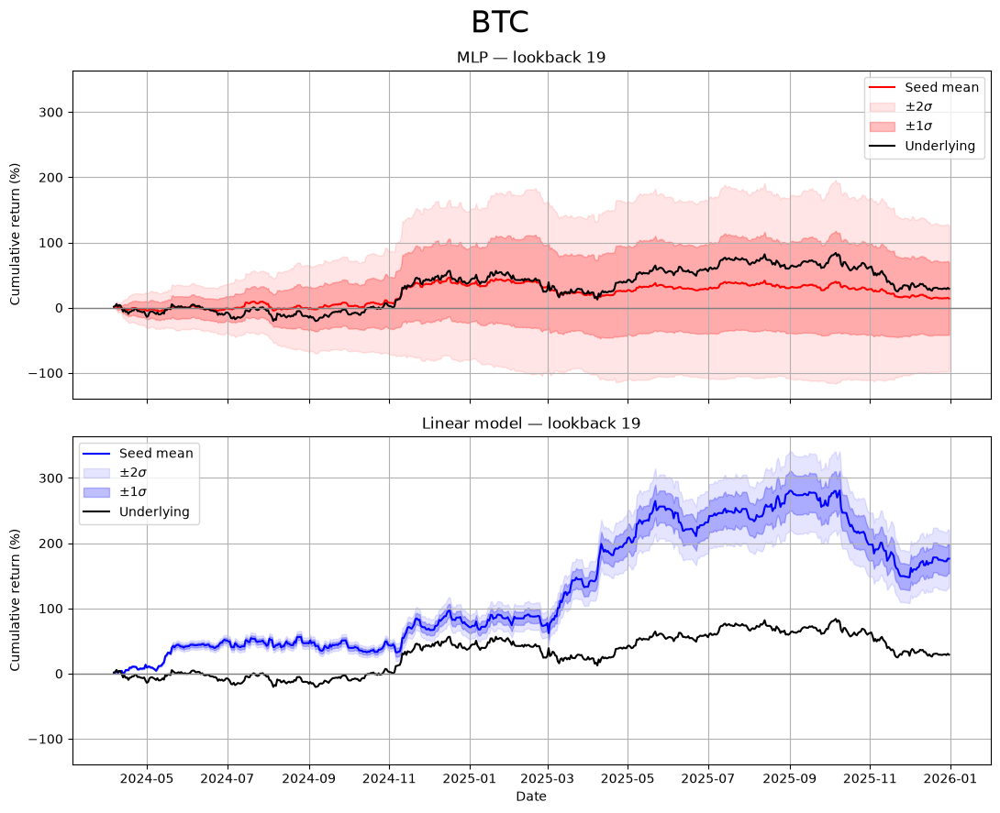
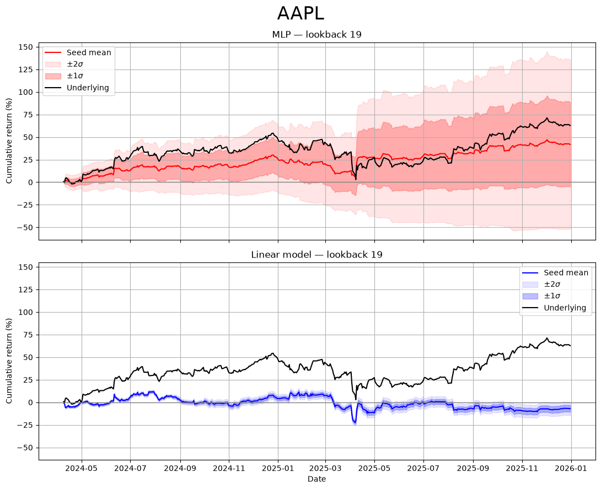
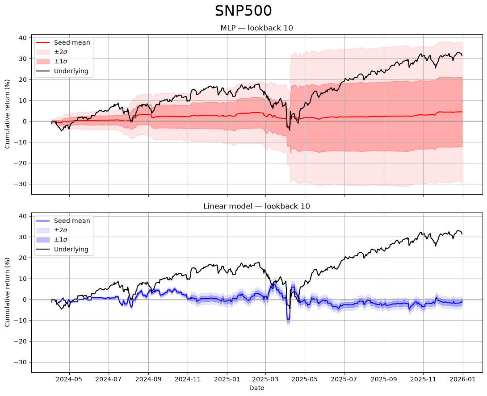

# Neural Network Pricing

This is a simple, exploratory research on Neural networks (NN) and their applicability to market predictions. We investigate how much information a NN could learn from just lookback data---feeding the NN with data of previous prices of a certain asset, and predict the price at the next timestep. 

We will compare a simple linear model and a MultiLayper Perceptron (MLP) model to investigate if nonlinearity improves model performance. Specifically, we test the model on three assets `AAPL`, `BTC-USD`, and the `S&P500`. We conclude that Linear models could potentially perform well in BTC, but not in the others; while MLP models are more random, and mostly fitting the noise in the data. 

This work is exploratory. While we conclude that Linear models could outperform MLP models in certain assets, it also reveals that lookback data along is insufficient---it leaves the MLP models with substantial seed dependencies; in other words, the input features could not reliably train the MLP models. 

Potential extension of this project is as follows:
1. Forward validation of the Linear models
2. Adding more input features, including the HLOC prices, not only the close price.
3. Investigate the performance of other type of regression, such as Ridge regression with hyperparameters. 
4. Other more complex trading strategy: We use only the sign of the predictions $\text{sign}(\hat{r})$. More information could potentially be drawn from the data.
--- 

## Planned Features

- [x] Linear model NN model for training 
- [x] Predict stock prices with NN 
- [x] Extend to nonlinear models

---

## Research Questions:
- [x] Could Neural network perform better than simple strategies such as mean reversion? *depends*
- [x] Does linear model (equivalent to autoregressive time series in the way I implemented) inferior to nonlinear Neural networks such as Multilayer-Perception (MLP) models? *no, sometimes can overperform MLP*
- [x] Given the same model, how much would different trading strategies changes the return? *yes*
- [x] Is the number of features (number of lag days) changing the performance of the model significantly? *yes*

---
## Method

We compare two Neural networks. Let $X_{t}$ be the asset price at time $t$, and $r_{t} = \ln \left( \frac{X_{t}}{X_{t-1}} \right)$ be the trade log return at time $t$. 

### `LinearModel`
The first model is defined by the class `LinearModel` in the file `networks/LinearModel.py`. It is a single-layer linear Neural network (NN) that maps:

$$
Lin: \underbrace{ \left(r_{t-1}, r_{t-2}\dots  \right)  }_{ n \text{ elements} } \rightarrow r_{t}\, , 
$$

this is equivalent to a autoregressive model $AR(n)$ on the log return $r_{t}$ without the noise term: 
$$
\hat{r}_{t} = \sum_{i=1}^{n} \phi_{i}r_{t-i} + c\, , 
$$
where $c$ is the constant bias. 

### `MLPModel`
The second model is again a NN, but instead of a single layer, we use a Multilayer Perceptron (MLP) model with architecture as below

### Data analysis
In training the model, we will split the data for training and testing. 

### Strategy
We employ a very simple strategy. Our model takes a set of $n$ lagged data and predicts the next possible price. However, it is found that the model cannot give accurate prediction on the _magnitude_ of the price. We therefore use the model to bet on the _direction_. 

1. *sign strategy*:  we use the signal $s_{t}$:
$$
s_{t} = \text{sign}(\hat{r}_{t})
$$
where $\hat{r}_{t}$ is the log return predicted by the models. 
2. *threshold strategy*: Another possibility for the signal is to set: 
	 $$
	s_{t} = \begin{cases}
	+1  &  \hat{r}_{t} > \epsilon  & \text{long}\\
	-1  &  \hat{r}_{t} < -\epsilon   & \text{short}\\
	0  &  \text{otherwise} & \text{hold}
	\end{cases}	
	$$
	here $\epsilon$ is the *threshold*. 

We also have a benchmark strategy, which is a simplified version of mean-reversion strategy:
	3. *mean reversion*: A simple strategy for benchmarking:
		$$
		s_{t} = -\text{sign}(r_{t-1})
		$$
		that is, we bet that the price will move opposite to the previous date.

---
## Results
It is found that, for any number of input data, a prediction based on simply the previous stock value is not enough. This is signified by 1. A strong dependence of the strategy return on the choice of seeds:

### Seed dependence 
We predict stock price with the daily closing price of `AAPL`  
1. `seed = 32`
		
2. `seed = 55`
        
		

These observations lead us to the folder `networks/average_over_seeds` where we average over randomly chosen seeds to obtain the performance.

## Seeds averaging
We average over $50$ seeds, randomly chosen from $[0,10000]$, to obtain the averaged performance of the model. It is found that the model depends strongly on the lookbacks and the stock of choice. We will post the result for the best performing lookback over time, and later analyse the model benchmarks across different stocks (or crypto currencies).

We use the close price of the assets from `2019-01-01` to `2026-01-01`, and train on $75\%$ of the data and test on the rest. 

### The case of Bitcoin:

where `lookback` is the length of history (in days) that the model have access to. It is the data number we feed to the model. 

It is found that MLP has much larger standard deviation across seeds averaging, this may suggest that MLP model needs more data input to reliably obtain model parameters. 

Interestingly, for Bitcoin `BTC-USD`, linear model outperforms MLP significantly. We also have:

we see that in most benchmarks, linear model beats the MLP model. In particular, we have 
    1. Pearson and Spearman IC have a small but consistent positive edge.
    2. The linear model has a consistent positive annualized Sharpe ratio (note $\sigma_{annualized} = \sqrt{365}\sigma$ since we have Bitcoin). 
    3. While Linear model has a lower win rate, which is the number of times when $\text{sign}({\hat{r}_t}) = \text{sign}({r_t})$

However, I have to emphasize that the model does not win in all other stocks. 

## The case of Apple stock `AAPL`
The return is very bad for Linear model in this case: 

we see clearly that the Linear model loses money and to the underlying stock badly. The benchmarks are:

Here the Linear model has a significantly worse win rate against the MLP model. Similar behaviours can be seen in the S&P500: 
## The case of the S&P500 

which is again an example of Linear model underperforming the MLP

