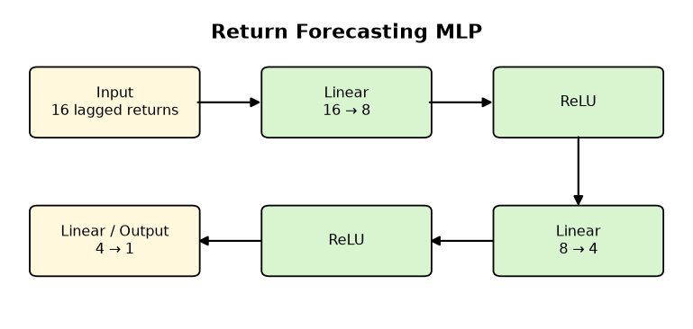
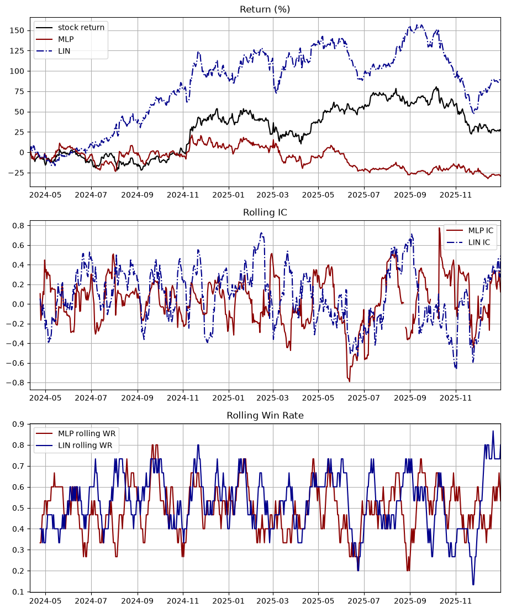
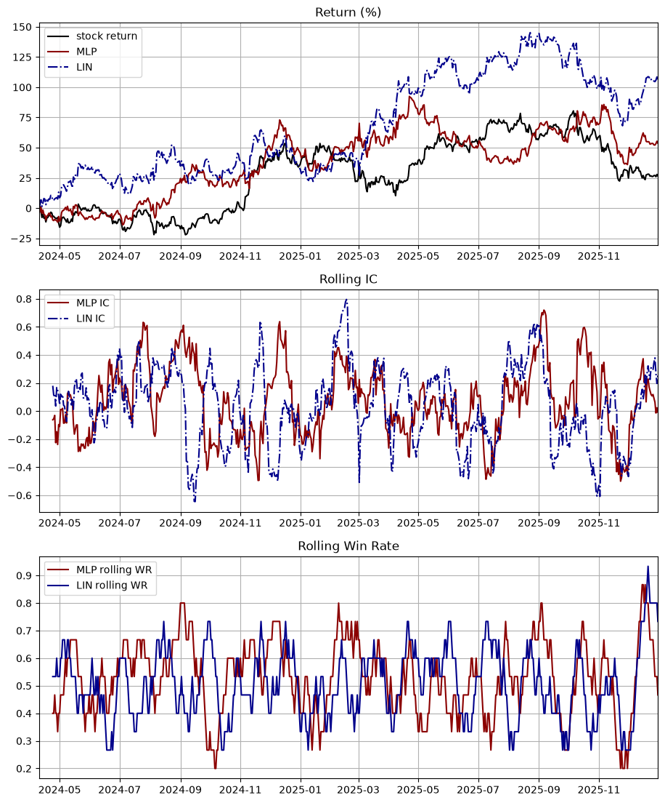
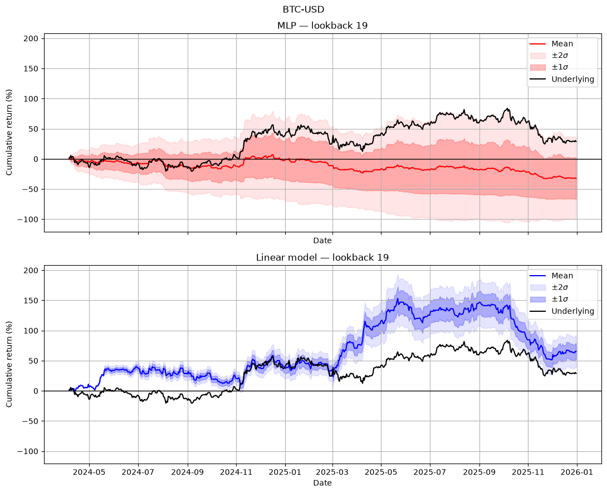
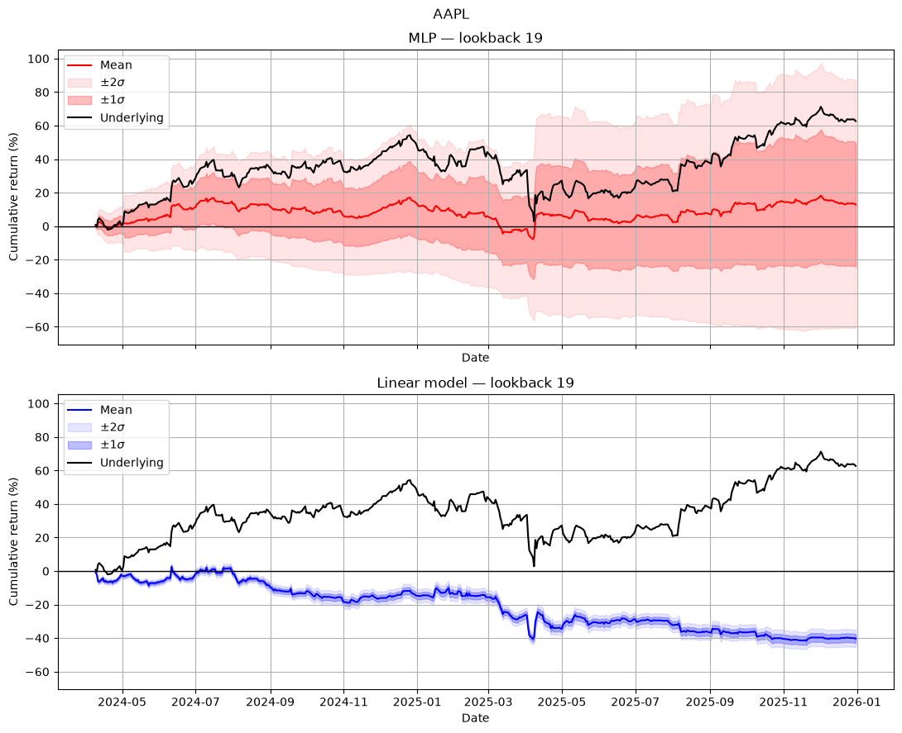
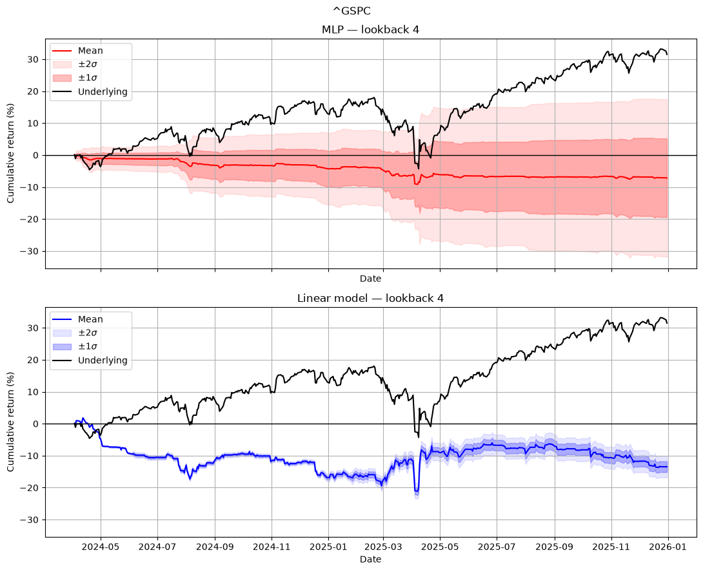

# Log-return forecasting: Comparing Linear and Nonlinear Neural Networks


This is a simple, exploratory research on Neural networks (NN) and their applicability to market predictions. We investigate how much information a NN could learn from the lagged log return.

We will compare a simple linear model and a Multilayer Perceptron (MLP) model to investigate if nonlinearity improves model performance. Specifically, we test the model on three assets `AAPL`, `BTC-USD`, and the `S&P500`. We conclude that Linear models could potentially perform well in BTC, but not in the others; while MLP models disperse across seed choice of initializations, consistent with a weak signal from the history of close-to-close log returns.

This work is exploratory. While we conclude that Linear models could outperform MLP models in certain assets, it in no way suggests that MLP is inherently inferior to a Linear model. Instead, one should interpret the finding of this work as revealing the inadequacy of predicting log return using solely the previous log returns of the corresponding asset---potentially more information is needed to train MLP models.

Potential extension of this project is as follows:
1. Forward validation of the Linear models
2. Adding more input features, including the OHLC prices, not only the close price.
3. Investigate the performance other regression methods, such as Ridge regression with hyperparameters. 
4. Other more complex trading strategy: We use only the sign of $\text{sign}(\hat{r})$. More information could potentially be drawn from the data. 
--- 

## Planned Features

- [x] Linear model NN model for training 
- [x] Close-to-close log return forecasting with NN 
- [x] Extend to nonlinear models

## Installation  

Clone the repository:
```bash
git clone https://github.com/sdf1267/NeuralNetworkQuant.git
cd "NeuralNetwork Pricing"
```

Then create a virtual enviroment:
```bash
python3 -m venv .venv
```

Activate it:

**macOS/Linux**

```bash
source .venv/bin/activate
```

**Windows PowerShell**

```powershell
.venv\Scripts\Activate.ps1
```

Install the project with:

```bash
python -m pip install --upgrade pip
python -m pip install -e ".[notebook]"
```
and verify with:

```bash
python -c "import numpy, pandas, matplotlib, torch, yfinance, scipy; print('Installation successful')"
```

### Quick installation for macOS:

```bash
git clone https://github.com/sdf1267/NeuralNetworkQuant.git
cd "NeuralNetwork Pricing"
python3 -m venv .venv
source .venv/bin/activate
python -m pip install --upgrade pip
python -m pip install -e ".[notebook]"
python -m jupyter lab
```


> ## Reproducing figures 
> Open `reproduce_graphs.ipynb` and click `Run All`. The default option will reproduce the figures 

## Research Questions:
- [x] Could Neural network perform better than simple strategies such as mean reversion? *depends*
- [x] Does linear model (equivalent to autoregressive time series in the way I implemented) inferior to nonlinear Neural networks such as Multilayer-Perception (MLP) models? *no, sometimes can overperform MLP*
- [x] Given the same model, how much would different trading strategies changes the return? *yes*
- [x] Is the number of features (number of lag days) changing the performance of the model significantly? *yes*

## Method

We compare two Neural networks. Let $X_{t}$ be the asset price at time $t$, and $r_{t} = \ln \left( \frac{X_{t}}{X_{t-1}} \right)$ be the trade log return at time $t$. 

### `LinearModel`
The first model is defined by the class `LinearModel` in the file `networks/LinearModel.py`. It is a single-layer linear Neural network (NN) that maps:

$$
Lin: \underbrace{ \left(r_{t-1}, r_{t-2}\dots  \right)  }_{ n \text{ elements} } \rightarrow r_{t}\, , 
$$

We define $n$ as the _lookbacks_. This is equivalent to an autoregressive model $AR(n)$ on the log return $r_{t}$ without the noise term: 
$$
\hat{r}_{t} = \sum_{i=1}^{n} \phi_{i}r_{t-i} + c\, , 
$$
where $c$ is the constant bias. 

### `MLPModel`
The second model is again a NN, but instead of a single layer, we use a Multilayer Perceptron (MLP) model with architecture as below




<!-- ### Data analysis
In training the model, we will split the data for training and testing. We divide the data chronologically into 75% for training and 25% for testing. Since the seeds of  -->

### Strategy
We employ a very simple strategy. Our model takes a set of $n$ lagged data and predicts the next possible price and focus on the __direction__:

 * **sign strategy**:  we use the signal $s_{t}$:
$$
s_{t} = \text{sign}(\hat{r}_{t})
$$
where $\hat{r}_{t}$ is the log return predicted by the models. In other words, we only take the direction of  $\hat{r}$ and discard the magnitude from the forecasting.
<!-- 2. *threshold strategy*: Another possibility for the signal is to set: 
	 $$
	s_{t} = \begin{cases}
	+1  &  \hat{r}_{t} > \epsilon  & \text{long}\\
	-1  &  \hat{r}_{t} < -\epsilon   & \text{short}\\
	0  &  \text{otherwise} & \text{hold}
	\end{cases}	
	$$
	here $\epsilon$ is the *threshold*.  -->

<!-- We also have a benchmark strategy, which is a simplified version of mean-reversion strategy:
	3. *mean reversion*: A simple strategy for benchmarking:
		$$
		s_{t} = -\text{sign}(r_{t-1})
		$$
		that is, we bet that the price will move opposite to the previous date. -->

> [!IMPORTANT]
> This is an exploratory work of a complex problem that I will not dare to say that I have solved. Instead, this work merely suggests that some profitability could be generated from linear NNs, despite the strong dependencies on the initialization seeds.
## Results
We conclude that the history of individual stock is insufficient for accurate price predictions. While in some asset the Linear model could yield some edge of profitability, the model becomes invalid for other assets. 

Specifically, we have discovered that models have strong dependence on the seed of the random number generators:

### Seed dependence 
We forecast the close-to-close log return price of `AAPL`  with transaction cost of 10 basis points and with the __sign strategy__:
1. `seed = 15`
		
2. `seed = 55`
        
		

These observations lead us to the folder `networks/average_over_seeds` where we average over randomly chosen seeds to obtain the performance.

### Seeds averaging
We average over $50$ seeds, randomly chosen from $[0,10000]$, to obtain the averaged performance of the model. We have transaction cost of 10 basis points. We use the close price of the assets from `2019-01-01` to `2026-01-01`, and train on $75\%$ of the data and test on the rest. 

Let _lookbacks_ be the number of days the NN has access to prior to the forecast date. Thus, `lookbacks=5` means the model input feature is the 5-day close-log-return. We found that the model depends strongly on the lookbacks and the stock of choice. 


### The case of Bitcoin:


We found that MLP has much larger standard deviation across seeds averaging, this may suggest that MLP model needs more data input to reliably obtain model parameters. 

Interestingly, for Bitcoin `BTC-USD`, linear model outperforms MLP significantly. We also have:

we see that in most benchmarks, linear model beats the MLP model. In particular, we have 

1. Pearson and Spearman IC have a small but consistent positive edge.
2. The linear model has a consistent positive annualized Sharpe ratio (note $\sigma_{annualized} = \sqrt{365}\sigma$ since we have Bitcoin). 
3. While Linear model has a lower win rate, which is the number of times when $\text{sign}({\hat{r}_t}) = \text{sign}({r_t})$, the average winning return is larger than the average losing return, leading to a positive total return.

This benchmark suggests that a linear model could produce edge of profitability that survives the assumed transaction costs (10 basis points) within the test period. However, this should be interpreted as elementary results that require further investigation rather than signs of consistent profitability.

__However, I have to emphasize that the model does not consistently generate revenue in all assets.__

### The case of Apple stock `AAPL`
For `AAPL`, both models perform significantly worse than `BTC` and consistently underperform the underlying asset.


The benchmarks are:


Here the Linear model has a significantly worse win rate against the MLP model. Similar behaviours can be seen in the S&P500: 
### The case of the S&P500 



which is again an example of Linear model underperforming the MLP

## Conclusions

We found that, while a MLP model contains more parameters and nonlinearity than a Linear model, the additional degrees of freedom do not translate to a better performance.

Note that, in no way does this study suggest that MLP model is inferior. Instead, what we discovered is that hisotry of lagged returns of a single asset alone is insufficient to train a reliable model. 
